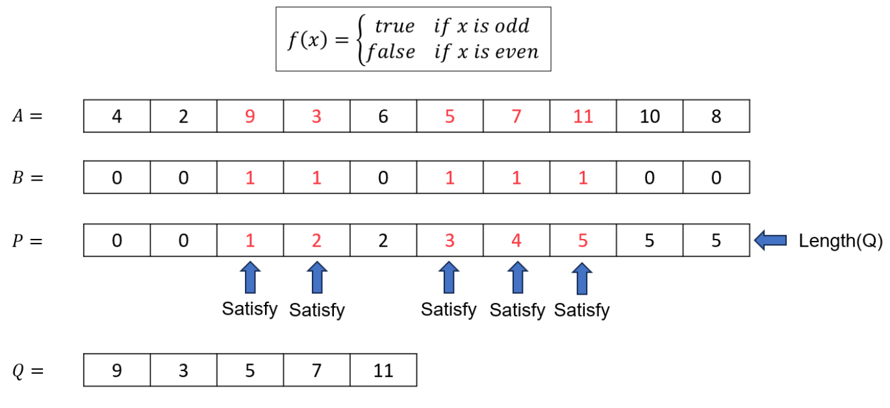

# ALGORITHM PARALLEL FILTER
Main idea: 
- Split array A into two subarrays based on a condition. One subarray B contains values that satisfy the condition (i.e., true), and the other subarray C contains values that do not (i.e., false).
- Next, mark elements in array A with 1 for true values and 0 for false.
- Then, perform a parallel prefix sum on the elements marked as 1 to generate the resulting prefix sum for A (positions corresponding to array B).
- For the false values (0s), temporarily convert them to 1, perform the same parallel prefix sum, and apply the results accordingly (similar to above for array C).

# PSEUDOCODE
```actionscript
Fuction filtering(A,F)    
    in parallel: 
        for i = 1 to length(A): 
            temp[i] = F(A[i])
    P = parallelPrefixSum(B)
    B = convert0begin1(B)
    Q = parallelPrefixSum(C)
    X = initArray[P.last_item]
    Y = initArray[Q.last_item]

    in parallel:
        for i = 1 to length(P):
            if (P[i] != P[i-1])
                X[P[i]] = A[i]
    in parallel:
        for j = 1 to length(Q):
            if(Q[i] != Q[i-1])
                Y[Q[j]] = A[i]
    return X, Y
```
Explain: 

# EXAMPLE

# COMPLEXITY
Work: O(N)
Depth: O(logN)
