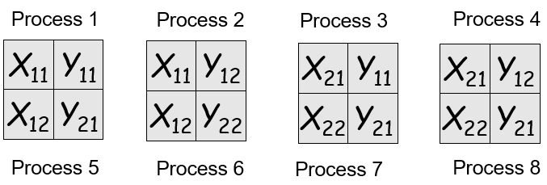

# ALGORITHM PARALLEL MATRIX MULTIPLICATION

Main idea: To perform parallel multiplication of two square matrices A and B, each matrix is divided into four equal submatrices. The recursive multiplication tasks are distributed across different processors. The resulting matrix 𝐶 is then assembled based on the following formula:

$$
\begin{aligned}
    &C_{11} = A_{11}B_{11} + A_{12}B_{21} \\
    &C_{12} = A_{11}B_{12} + A_{12}B_{22} \\
    &C_{21} = A_{21}B_{11} + A_{22}B_{21} \\
    &C_{22} = A_{21}B_{12} + A_{22}B_{21}
\end{aligned}
$$

# PSEUDOCODE
```actionscript
fuction matrix_multiply(A,B):
    In parallel for i = 1,2,...,n do:
        In parallel for j = 1,2,...,n do:
            for k = 1,2,...,n do:
                temp[k] = A[i][k] * B[k][j];
            C[i][j] = reduce(temp,N)

fuction reduce(D,N):
    if n==1 return D[0];
    In parallel:
        L = reduce(C, n/2);
        R = reduce(C + n/2, n-n/2);
    return L+R;
```
Explain:
- In matrix_multiply, we take two input matrices A and B. The outermost loop assigns each row index i (from 0 to n−1) to a separate processor, resulting in n independent processors.
- Each processor then independently iterates over column index j (also from 0 to n−1). At this point, the total number of concurrent processors used is n × n.
- For each (i, j) pair, we run a sequential loop over k from 0 to n−1. In this loop, we compute the product A[i][k] * B[k][j] and store it in temp[k].
- After the temp array is fully populated, we call the reduce function to sum its elements in parallel using a divide-and-conquer approach. This result becomes the value of Z[i][j]. 

# EXAMPLE


And compute 8 submatrix products recursively

$$
\begin{aligned}
    &Z_{11} = X_{11}Y_{11} + X_{12}Y_{21} \\
    &Z_{12} = X_{11}Y_{12} + X_{12}Y_{22} \\
    &Z_{21} = X_{21}Y_{11} + X_{22}Y_{21} \\
    &Z_{22} = X_{21}Y_{12} + X_{22}Y_{21}
\end{aligned}
$$




Explain:
- Each value in column i of matrix A (with i ranging from 0 to n) is multiplied with the corresponding cell in row j of matrix B (with j ranging from 0 to n). Each such multiplication is assigned to a different processor to ensure independent processing.

- Then, the result from each processor is returned and summed up. This produces the value of cell k in the result matrix Z, where k ranges from 0 to n.
# COMPLEXITY
Because the calculation is performed within two-level nested loops over matrices A and B, each of size n × n, the initial time complexity is O(N²) due to the outer loops over i and j.

The innermost loop iterates over k from 0 to n, but this step is processed in parallel and independently across different processors. Specifically, each recursive call spawns 8 independent subproblems, each of size N/2. Therefore, the recurrence relation for total work becomes:

$$
\begin{aligned}
W(N) = O(N²) + 8 * W(N/2)\\
W(N)=𝑁^2+8((𝑁/2)^2+8𝑊(𝑁/4))\\
W(N)=𝑁^2+2𝑁^2+4𝑁^2+…+8^{log_2⁡𝑛}  (𝑁/2^{log_2⁡𝑛})^2\\
W(N) = O(N^3)
\end{aligned}
$$

Thus, the total work complexity is O(N³).

At each level of the divide step, some tasks must be executed sequentially (for example, adding submatrices), which results in a time complexity of O(log N).

After that, the algorithm continues recursively with submatrices of size N/2, leading to the recurrence relation:

$$
\begin{aligned}
D(N) = O(logN) + D(N/2)\\
D(N) = O(log^2N)
\end{aligned}
$$
